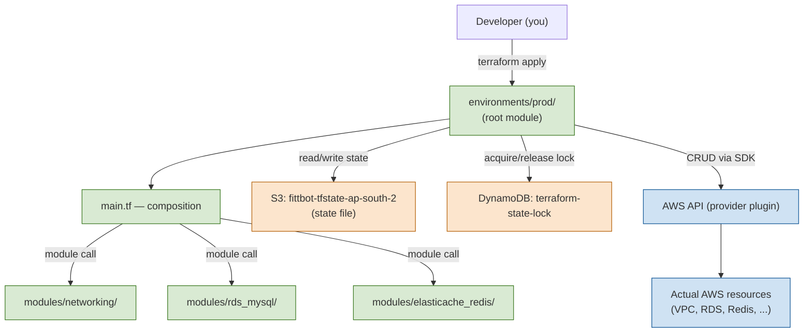
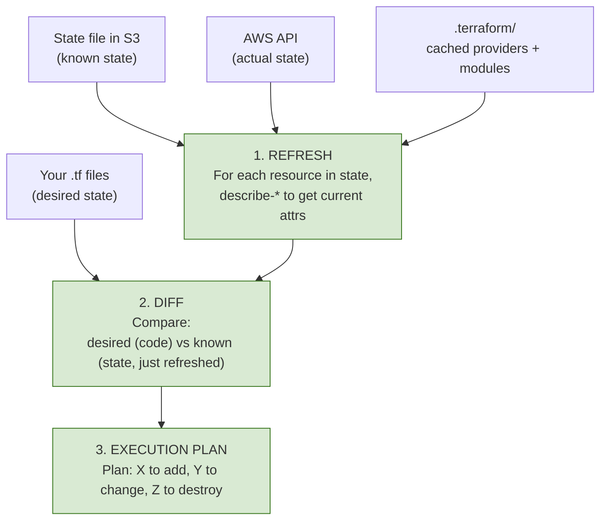
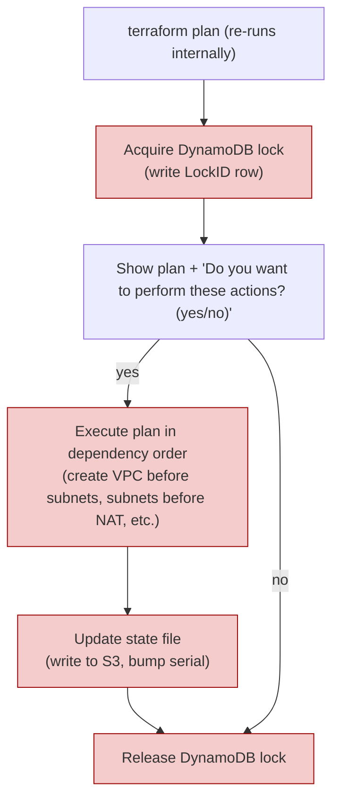

# Terraform — From First Principles to Interview Mastery

A deep walkthrough of how Terraform actually works, using **your** Fittbot infra as the running example. By the end you'll be able to answer every Terraform question in a Staff-level interview.

---

## 1. The mental model (the only one that matters)

Terraform is a **declarative state machine** that reconciles three worlds:

```
┌─────────────────────────────────────────────────────────────────┐
│                                                                 │
│   1. YOUR CODE (the desired state)                              │
│      ─ .tf files in git                                         │
│      ─ "I want a VPC named fittbot-prod-vpc with CIDR ..."      │
│                                                                 │
│                       │  terraform                              │
│                       │  reconciles                             │
│                       ▼                                         │
│                                                                 │
│   2. THE STATE FILE (Terraform's memory)                        │
│      ─ terraform.tfstate in S3                                  │
│      ─ "I know about VPC vpc-0f268f... and it has these attrs"  │
│                                                                 │
│                       │  AWS API calls                          │
│                       ▼                                         │
│                                                                 │
│   3. THE REAL CLOUD (the actual state)                          │
│      ─ vpc-0f268f... actually exists in AWS                     │
│      ─ The ground truth                                         │
│                                                                 │
└─────────────────────────────────────────────────────────────────┘
```

**Every Terraform operation is about syncing these three.** When `1 == 2 == 3`, nothing happens. When they diverge, Terraform plans actions to converge them.

- `1 ≠ 2` (code changed, state hasn't caught up) → `terraform plan` shows changes, `terraform apply` makes them
- `2 ≠ 3` (someone changed AWS via console — drift) → `terraform plan -refresh-only` detects it
- `1 ≠ 3` and `2` doesn't know either (imported resource not in state) → `terraform import` adds it to state

That's the whole product. Everything else is mechanics.

---

## 2. Why each folder exists (anatomy of your infra/)

```
infrastructure/
├── global/backend-bootstrap/     ◄── BOOTSTRAP: one-time setup of state backend
├── environments/
│   └── prod/                     ◄── THE ROOT MODULE: this is what you run terraform in
│       ├── backend.tf            ◄── Tells Terraform WHERE state lives
│       ├── providers.tf          ◄── Tells Terraform HOW to talk to AWS
│       ├── versions.tf           ◄── Locks Terraform/provider versions
│       ├── variables.tf          ◄── Inputs to this environment
│       ├── locals.tf             ◄── Computed values used everywhere
│       ├── main.tf               ◄── COMPOSITION: which modules to use
│       ├── outputs.tf            ◄── What this env exposes upward
│       ├── terraform.tfvars      ◄── ACTUAL VALUES for variables
│       └── imports/              ◄── One-time import blocks (deleted after backfill)
└── modules/
    ├── networking/               ◄── CHILD MODULE: reusable VPC + subnets logic
    │   ├── main.tf               ◄── Resources defined here
    │   ├── variables.tf          ◄── What inputs this module takes
    │   ├── outputs.tf            ◄── What this module exposes
    │   └── README.md
    ├── rds_mysql/                ◄── CHILD MODULE: reusable RDS logic
    └── ...
```

### The mental rule

> **You run `terraform` commands ONLY inside an environment folder (the "root module"). Modules are libraries that get composed into root modules.**

You'd never `cd modules/networking && terraform apply` — that module has no state, no backend, no providers. It's a recipe, not a deployment.

### Why split modules vs environments?

| Question | Answer |
|---|---|
| **Why not one big main.tf with all resources?** | Imagine adding staging later. You'd duplicate ALL 500 lines. With modules, staging is `module "networking" { ... different_cidr }` — 10 lines. |
| **Why `imports/` as a separate folder?** | Import blocks are a one-time use. Once backfill is done, you delete the folder. Keeping them in `main.tf` would clutter your "what does prod look like?" file forever. |
| **Why `global/backend-bootstrap/` is separate?** | Chicken-and-egg: state backend must exist before any environment can use it. Bootstrap uses local state (the default), produces S3+DynamoDB, then all envs use that S3 backend. You run bootstrap **once**, ever. |
| **Why `terraform.tfvars` instead of hardcoded?** | You can override values per-environment without touching variables.tf. Want to change AWS region for staging? `staging/terraform.tfvars` overrides the default. |

### How they work as one system



---

## 3. The state file — the most important concept

### What's inside `terraform.tfstate`?

A JSON file like this:

```json
{
  "version": 4,
  "terraform_version": "1.5.7",
  "serial": 42,
  "lineage": "8a3f...-unique-id-...",
  "resources": [
    {
      "module": "module.networking",
      "type": "aws_vpc",
      "name": "main",
      "instances": [{
        "attributes": {
          "id": "vpc-0f268fb3dc0dd0600",
          "cidr_block": "10.0.0.0/16",
          "enable_dns_hostnames": true,
          "tags": { "Name": "fittbot-prod-vpc" }
        }
      }]
    }
  ]
}
```

**Key fields:**
- `version`: state file schema version (Terraform's internal version)
- `serial`: incremented on every state change (1, 2, 3, ...). Used to detect concurrent edits.
- `lineage`: a UUID identifying this state file. Two state files with different lineages are unrelated.
- `resources`: the list of every resource Terraform knows about

### Why this file is sacred

Terraform's only way to know "what already exists" is this file.

- **No state file** → Terraform thinks nothing exists → next apply tries to CREATE everything → **boom, duplicate resources** or errors
- **Corrupted state** → Terraform may think it owns resources that don't exist → next apply tries to UPDATE a missing resource → fails
- **Two engineers edit at once with no lock** → one overwrites the other's state → **state divergence** → very hard to recover

This is why every safety mechanism (S3 versioning, DynamoDB locking, `prevent_destroy`) revolves around the state file.

### Where it lives in your setup

```
S3: fittbot-tfstate-ap-south-2 (versioned, encrypted)
├── prod/terraform.tfstate              ◄── prod env state
└── (staging/terraform.tfstate)         ◄── when staging is added
```

Plus:

```
DynamoDB: terraform-state-lock
└── LockID: "fittbot-tfstate-ap-south-2/prod/terraform.tfstate-md5"
    Info: { ID: ..., who: ..., created: ..., operation: "OperationTypePlan" }
```

While Terraform runs, a row exists in DynamoDB. When it completes, the row is deleted. If someone else tries to run `terraform plan` at the same time, they get an error: `Error acquiring the state lock`.

### What state locking prevents (real scenario)

```
T+0s    Engineer A: terraform apply  → acquires lock, starts modifying state
T+1s    Engineer B: terraform apply  → "ERROR: state lock held by A, retrying..."
T+30s   Engineer A: apply completes  → releases lock
T+31s   Engineer B: terraform plan   → reads A's updated state, sees A's changes
        Engineer B: terraform apply  → safely continues from updated state
```

Without the lock, B would have read STALE state, applied conflicting changes, and you'd have a corrupted state with resources "owned" by both runs.

---

## 4. The three core operations — what they actually do

### `terraform init`

```
1. Reads versions.tf → which Terraform version + which providers needed
2. Downloads provider plugins (hashicorp/aws) to .terraform/
3. Initializes backend (reads backend.tf, connects to S3, verifies lock table)
4. Resolves modules (downloads/links module sources)
5. NO AWS calls, NO state changes
```

You run `init` once per folder, or whenever you change providers/backends/modules.

### `terraform plan` — the safe read-only inspection



**Crucial: `terraform plan` makes ZERO writes — to AWS or to state file.** It reads from AWS to refresh, then prints a plan.

Example output (real):

```
Terraform will perform the following actions:

  # module.networking.aws_vpc.main will be created
  + resource "aws_vpc" "main" {
      + cidr_block = "10.0.0.0/16"
      + id         = (known after apply)
      + tags_all   = {
          + "Name"        = "fittbot-prod-vpc"
          + "Environment" = "prod"
        }
    }

Plan: 1 to add, 0 to change, 0 to destroy.
```

Symbols in plan output:
- `+` create
- `-` destroy
- `~` update in-place (no replace)
- `-/+` destroy and re-create (REPLACE — dangerous)
- `<=` data source read

**`-/+` is the dangerous one.** Look out for it. It means "this resource will be deleted and a new one created." For an RDS instance, that means **5+ minutes of downtime and a fresh empty database**. Always check WHY before applying.

### `terraform apply` — the only step that changes AWS



Each resource modification is:
1. Call AWS API (`CreateVpc`, `DeleteSubnet`, `ModifyDBInstance`, etc.)
2. Wait for AWS to confirm (poll until status = available/active)
3. Read back the actual attributes (e.g., the auto-generated `vpc-id`)
4. Write those attributes into the state file

**Failure handling:** if step 3 succeeds but step 4 fails (network issue writing to S3), the resource exists in AWS but **NOT in state**. Next `terraform plan` will want to recreate it. You'd fix this by `terraform import` to re-link it.

This is why **always use remote state with locking** — local state on your laptop is a single hard-drive failure away from this hell.

### `terraform destroy` — the dangerous one

```
1. Plan = "destroy every resource in state, in reverse dependency order"
2. Acquire lock
3. Prompt "yes/no"
4. Execute: delete leaves first (e.g., subnet associations),
            then nodes (subnets), then root (VPC)
5. Remove from state, release lock
```

**This is why `lifecycle { prevent_destroy = true }` exists.** Terraform will literally refuse to plan the destruction of a resource with that flag, no matter what you do:

```hcl
resource "aws_db_instance" "main" {
  # ... config ...
  lifecycle {
    prevent_destroy = true
  }
}
```

```
$ terraform destroy
Error: Instance cannot be destroyed
  on .../rds_mysql/main.tf line 8:
   8: resource "aws_db_instance" "main" {

Resource aws_db_instance.main has lifecycle.prevent_destroy set, but
the plan calls for this resource to be destroyed.
```

You'd have to **edit the code, remove `prevent_destroy`, plan, apply** before destroy succeeds. That's an intentional speed bump.

---

## 5. How changes work — adding, modifying, destroying

### Adding a resource

You add HCL:

```hcl
resource "aws_s3_bucket" "logs" {
  bucket = "fittbot-app-logs"
}
```

```bash
terraform plan
# Plan: 1 to add, 0 to change, 0 to destroy.

terraform apply
# aws_s3_bucket.logs: Creating...
# aws_s3_bucket.logs: Creation complete after 2s [id=fittbot-app-logs]
# Apply complete! Resources: 1 added, 0 changed, 0 destroyed.
```

What happened internally:
1. Lock acquired
2. AWS `CreateBucket` API called
3. Wait for `200 OK`
4. Read back bucket attributes (ARN, region, hosted zone)
5. Write to state file: `aws_s3_bucket.logs = { id: "fittbot-app-logs", arn: "arn:..." }`
6. Lock released

### Modifying in-place (the easy case)

You change a tag:

```hcl
resource "aws_s3_bucket" "logs" {
  bucket = "fittbot-app-logs"
  tags = {
    Owner = "naveen"  # added
  }
}
```

```bash
terraform plan
# ~ resource "aws_s3_bucket" "logs" {
#     ~ tags = {
#         + "Owner" = "naveen"
#       }
#   }
# Plan: 0 to add, 1 to change, 0 to destroy.
```

The `~` means **update-in-place** — no destroy. Tags can be added via `PutBucketTagging` API without deleting the bucket. Safe.

### Modifying that forces a replace (the dangerous case)

You change the bucket name:

```hcl
resource "aws_s3_bucket" "logs" {
  bucket = "fittbot-app-logs-v2"  # name changed
}
```

```bash
terraform plan
# -/+ resource "aws_s3_bucket" "logs" {
#       ~ bucket = "fittbot-app-logs" -> "fittbot-app-logs-v2" # forces replacement
#     }
# Plan: 1 to add, 0 to change, 1 to destroy.
```

`-/+` means **destroy and re-create**. The bucket name can't change in-place (S3 bucket names are global IDs), so Terraform would delete it and make a new one. **All your data inside the bucket disappears.**

**This is the single biggest mistake people make.** They see `-/+` and apply anyway, thinking it's the same as `~`. Read every plan carefully. Look for `forces replacement` annotations.

### Destroying a single resource

```bash
# Remove from .tf code
$ terraform plan
# - resource "aws_s3_bucket" "logs" {}
# Plan: 0 to add, 0 to change, 1 to destroy.

$ terraform apply
# aws_s3_bucket.logs: Destroying...
# aws_s3_bucket.logs: Destruction complete after 1s
```

After this:
- AWS bucket is gone
- State no longer tracks `aws_s3_bucket.logs`

### Removing from state WITHOUT destroying in AWS

```bash
terraform state rm aws_s3_bucket.logs
# Removed aws_s3_bucket.logs
# Successfully removed 1 resource instance(s).
```

This **only touches the state file**, not AWS. Useful when:
- You're transferring resource ownership to a different state file
- The resource was imported by mistake
- AWS already deleted the resource (manually) and state is stale

Mirror command: `terraform import` (adds to state without creating in AWS).

---

## 6. History & rollback — every Terraform safety net

### Layer 1: S3 versioning

Your state backend has `versioning = Enabled`. Every time Terraform writes a new state, the previous version is preserved.

```bash
# List all versions of the prod state file
aws s3api list-object-versions \
  --bucket fittbot-tfstate-ap-south-2 \
  --prefix prod/terraform.tfstate

# Output:
# Versions:
#   - VersionId: a1b2c3..., LastModified: 2026-05-14T03:00Z, Size: 42KB
#   - VersionId: x9y8z7..., LastModified: 2026-05-13T18:00Z, Size: 41KB
#   - VersionId: p5q6r7..., LastModified: 2026-05-13T09:00Z, Size: 41KB
```

**To roll state back to a specific version:**

```bash
# Copy a previous version to be the current one
aws s3api copy-object \
  --bucket fittbot-tfstate-ap-south-2 \
  --copy-source "fittbot-tfstate-ap-south-2/prod/terraform.tfstate?versionId=x9y8z7..." \
  --key "prod/terraform.tfstate"

# Now run terraform plan — it'll diff against the OLDER state
terraform plan
# Plan will likely show "1 to destroy" for resources in the rolled-back state
```

⚠️ State rollback **does NOT roll back AWS resources.** If Terraform created an RDS at 18:00 and you roll state back to 09:00, the RDS still exists in AWS but Terraform doesn't track it anymore. You'd have to either delete it manually or re-import it.

### Layer 2: Git history (the real source of truth)

Your `.tf` files are in git. Rollback there is normal:

```bash
git log infrastructure/environments/prod/main.tf
# commit abc123  "Add SQS queue for reminders"
# commit def456  "Switch RDS to t4g.medium"
# commit ghi789  "Initial prod state"

# Roll back the .tf file
git checkout def456 -- infrastructure/environments/prod/main.tf

# Now plan — Terraform diffs the OLDER code against CURRENT state
terraform plan
# Shows what would change to undo the recent commits
```

This is the **safer** rollback path: git rollback the code → `terraform plan` to see what would happen → `terraform apply` to actually undo.

### Layer 3: The CodeDeploy + Razorpay pattern (atomic + idempotent)

For ECS services managed by CodeDeploy (which is your setup), rollback is even better:
- Each deploy produces a new task-definition revision (e.g., `Fittbot-Production:189`)
- The old revision (`:188`) is still in the AWS account
- Rollback = update the service to use `:188`
- 1-minute revert

### Layer 4: `terraform state` surgery

The `terraform state` subcommand lets you manipulate state directly:

| Command | What it does |
|---|---|
| `terraform state list` | List every resource in state |
| `terraform state show <addr>` | Print one resource's attributes |
| `terraform state rm <addr>` | Remove from state (NOT from AWS) |
| `terraform state mv <src> <dst>` | Rename in state (e.g., refactoring modules) |
| `terraform state pull` | Download raw state as JSON |
| `terraform state push <file>` | Upload raw state (DANGEROUS — overwrites) |
| `terraform state replace-provider` | When provider name changes |

`terraform state mv` is what you use during refactoring. Example: you decide to move `aws_vpc.main` from the root module into `module.networking`:

```bash
terraform state mv aws_vpc.main module.networking.aws_vpc.main
# Successfully moved 1 object(s).
```

No AWS changes. State is updated. Next plan: clean.

### Layer 5: `prevent_destroy` — the ejection seat

```hcl
lifecycle {
  prevent_destroy = true
}
```

Terraform refuses to plan a destroy of this resource. If someone tries:

```
Error: Instance cannot be destroyed
```

The only way past this is to (1) edit the HCL to remove `prevent_destroy`, (2) commit, (3) plan, (4) apply. **Three intentional human steps.** Hard to do by accident.

---

## 7. Drift detection — the MNC superpower

Drift = when AWS reality diverges from what state says.

Scenarios:
- Someone changes RDS class via the AWS console (state still says old class)
- AWS automatically updates a Lambda runtime
- A failed apply left partial changes in AWS but didn't update state
- Manual cleanup of an orphaned resource

**Detection:**

```bash
terraform plan -refresh-only
```

This is a special mode: Terraform refreshes from AWS (read-only) but doesn't compare against your code. It only updates state to match reality and prints the diff.

```
Note: Objects have changed outside of Terraform

Terraform detected the following changes made outside of Terraform since
the last "terraform apply":

  ~ aws_db_instance.main
      ~ instance_class = "db.t3.medium" -> "db.t3.large"   # someone resized in console!
```

You then choose:
- Accept drift: `terraform apply -refresh-only` (updates state to match AWS)
- Reject drift: `terraform apply` (changes AWS back to match code)

MNCs run `terraform plan -refresh-only` **nightly in CI** with alerts. If drift is detected, someone gets paged. This is what makes IaC reliable at scale.

---

## 8. The dependency graph (interview favorite)

When you write:

```hcl
resource "aws_vpc" "main" {
  cidr_block = "10.0.0.0/16"
}

resource "aws_subnet" "private" {
  vpc_id     = aws_vpc.main.id   # ← implicit dependency
  cidr_block = "10.0.10.0/24"
}
```

Terraform builds a **directed acyclic graph (DAG)**:

```
aws_vpc.main
     │
     ▼
aws_subnet.private
```

It then **parallelizes** the apply: anything not in each other's lineage runs concurrently. Default parallelism is 10. So if you have 10 unrelated S3 buckets, they're all created at once.

For a destroy, the graph is **reversed** — subnets destroyed before VPC.

You can force ordering when no attribute reference exists, using `depends_on`:

```hcl
resource "aws_lambda_function" "fn" {
  # ...
  depends_on = [aws_iam_role_policy_attachment.lambda_basic]
}
```

Useful when an implicit ordering exists in AWS but not in HCL (e.g., a Lambda needs its IAM role policy attached before it can execute).

**Inspect the graph:**

```bash
terraform graph | dot -Tpng > graph.png
```

(Needs Graphviz installed — which you have.)

---

## 9. Modules — your reusable building blocks

A module is just a folder with .tf files. Calling it:

```hcl
module "networking" {
  source = "../../modules/networking"
  vpc_cidr             = "10.0.0.0/16"
  azs                  = ["ap-south-2a", "ap-south-2b", "ap-south-2c"]
  public_subnet_cidrs  = ["10.0.0.0/24", "10.0.1.0/24", "10.0.2.0/24"]
  private_subnet_cidrs = ["10.0.10.0/24", "10.0.11.0/24", "10.0.12.0/24"]
  tags                 = local.common_tags
}

# Access module outputs:
resource "aws_db_instance" "main" {
  vpc_security_group_ids = [module.networking.rds_security_group_id]
  db_subnet_group_name   = module.networking.db_subnet_group_name
}
```

Inside the module:
- `variables.tf` — what the module accepts (the interface)
- `outputs.tf` — what the module exposes
- `main.tf` — the resources

Modules can **call other modules** — composition.

### Why modules matter

Without modules, adding a staging environment means 500 lines of duplicated code. With modules:

```hcl
# environments/staging/main.tf
module "networking" {
  source = "../../modules/networking"
  vpc_cidr             = "10.1.0.0/16"   # different from prod
  azs                  = ["ap-south-2a", "ap-south-2b"]  # cheaper, fewer AZs
  # ... rest is the same as prod
}
```

You get a sibling VPC for staging in 10 lines. **That's the entire reason for the modules/ folder.**

---

## 10. Variables, locals, outputs — the data flow

```
terraform.tfvars  ──>  variables.tf  ──>  locals.tf  ──>  resources  ──>  outputs.tf
   (values)            (declarations)      (computed)      (consume)       (expose)
```

### Variables

```hcl
# variables.tf
variable "region" {
  type        = string
  default     = "ap-south-2"
  description = "AWS region"

  validation {
    condition     = startswith(var.region, "ap-")
    error_message = "Region must be an Asia-Pacific region."
  }
}

# terraform.tfvars
region = "ap-south-2"

# Usage:
provider "aws" {
  region = var.region
}
```

### Locals (computed values)

```hcl
locals {
  common_tags = {
    Project     = var.project
    Environment = var.environment
    ManagedBy   = "terraform"
  }

  name_prefix = "${var.project}-${var.environment}"
}

# Usage:
resource "aws_s3_bucket" "uploads" {
  bucket = "${local.name_prefix}-uploads"
  tags   = local.common_tags
}
```

Locals are great for **DRY**. Used to be a one-liner; rapidly become indispensable.

### Outputs

```hcl
# modules/networking/outputs.tf
output "vpc_id" {
  value = aws_vpc.main.id
}

# environments/prod/outputs.tf
output "vpc_id" {
  value = module.networking.vpc_id
}

# After apply:
$ terraform output vpc_id
"vpc-0f268fb3dc0dd0600"
```

Outputs are how environments expose values to other systems (CI, other Terraform stacks via `terraform_remote_state`, scripts).

---

## 11. `count` vs `for_each` — the meta-arguments

### `count` — index-based

```hcl
resource "aws_subnet" "private" {
  count             = 3
  vpc_id            = aws_vpc.main.id
  cidr_block        = "10.0.${count.index + 10}.0/24"
  availability_zone = ["ap-south-2a", "ap-south-2b", "ap-south-2c"][count.index]
}
# Creates: aws_subnet.private[0], aws_subnet.private[1], aws_subnet.private[2]
```

**Problem**: if you ever remove `private[0]` from the list (or change order), all subsequent indices shift, Terraform sees `[1] -> [0], [2] -> [1]`, and **plans to recreate them all**.

### `for_each` — key-based (preferred)

```hcl
resource "aws_subnet" "private" {
  for_each = {
    "ap-south-2a" = "10.0.10.0/24"
    "ap-south-2b" = "10.0.11.0/24"
    "ap-south-2c" = "10.0.12.0/24"
  }
  vpc_id            = aws_vpc.main.id
  cidr_block        = each.value
  availability_zone = each.key
}
# Creates: aws_subnet.private["ap-south-2a"], ["ap-south-2b"], ["ap-south-2c"]
```

Removing one entry doesn't affect the others. **Use `for_each` 95% of the time.** `count` only when the list is truly ordinal (like NAT gateways "0" "1" "2").

---

## 12. The 25 hardest interview questions (with deep answers)

### Q1. What is the state file and why is it needed?

> The state file is Terraform's record of what resources it manages and their current attributes. It maps logical HCL resource addresses (e.g., `module.networking.aws_vpc.main`) to real cloud IDs (`vpc-0f268f...`). Without it, every plan would have to scan all of AWS to figure out what exists — slow, expensive, and impossible to do reliably for ambiguous resources. State also caches attributes so subsequent runs don't re-fetch unchanged data, and it stores **dependency information** needed to compute correct plan order.

### Q2. What happens if the state file is lost?

> Terraform forgets every resource. Next plan would try to create everything fresh, leading to either duplicate resources (if names allow) or conflicts. Recovery: use `terraform import` to re-link each resource individually. This is why remote state with S3 versioning is mandatory in production — it's not just a backup, it's an audit trail of every state mutation.

### Q3. How does state locking work?

> When Terraform starts a mutating operation, it writes a row to a lock backend (DynamoDB in your case, but it can be Consul, Postgres, Azure Blob lease, etc.). The row contains the operator's identity, operation type, and a timestamp. Other Terraform processes that try to acquire the same lock get a `LockTimeoutError`. Once the operation completes (success or failure), the row is deleted. If a process crashes without releasing, the lock can be forcibly broken with `terraform force-unlock <lock-id>`. The lock prevents the classic dual-write race condition where two engineers apply against the same state simultaneously.

### Q4. Difference between `terraform plan` and `terraform apply`?

> `plan` is read-only: it refreshes state from cloud APIs (write to local memory only), diffs against your code, and produces an execution plan. `apply` does plan internally, then **executes** that plan against the cloud, then writes the resulting state back to the backend. Crucially, `apply` only does what plan promised — nothing more, nothing less. You can save a plan to a file (`terraform plan -out=tfplan`) and apply that exact plan later (`terraform apply tfplan`) for deterministic deployment.

### Q5. What's the difference between `terraform import` and `terraform refresh`?

> Both are read-only on AWS, but they serve different purposes. `terraform import` brings a resource that **already exists in AWS but not in state** into state — you specify the resource address and AWS ID, and Terraform fetches the attributes and writes them. `terraform refresh` (now `terraform apply -refresh-only`) updates **existing state entries** with their current cloud values — useful for detecting drift. Import adds; refresh updates.

### Q6. What does `lifecycle.prevent_destroy` do, and what does it NOT do?

> It causes Terraform to refuse any plan that would destroy the resource. It blocks both explicit `terraform destroy` and accidental destroys from things like a name change that forces replacement. It does NOT prevent deletion via the AWS console, nor does it prevent destruction by removing the resource block from code if you also remove the lifecycle block. It's a guardrail against carelessness, not a security control.

### Q7. What's `create_before_destroy` and when do you use it?

> A lifecycle option that reverses Terraform's default replacement order. Default: delete the old resource, then create the new one (downtime!). With `create_before_destroy = true`, the new resource is created first, traffic shifted, then the old destroyed. Useful for ALB target groups, ASGs, RDS read replicas. Caveat: it requires the new resource to coexist briefly with the old — name collisions become a problem, so you typically use computed names or random suffixes.

### Q8. What's the dependency graph and why does it matter?

> Terraform parses all `.tf` files, builds a directed acyclic graph (DAG) of resources connected by attribute references (e.g., `subnet.vpc_id = aws_vpc.main.id` creates an edge). On apply, Terraform performs a topological sort and processes resources in dependency order, parallelizing wherever possible (default 10 workers). On destroy, the graph is reversed. Use `terraform graph | dot -Tpng` to visualize. This is also why **avoiding circular dependencies** is so important — Terraform will detect them and abort.

### Q9. How would you migrate Terraform state from local to S3?

> 1. Define the S3 backend in `backend.tf` (S3 bucket + DynamoDB lock table created first, separately, with local state).
> 2. Run `terraform init`. Terraform detects the backend has changed and prompts: "Do you want to copy existing state to the new backend?" — answer yes.
> 3. Terraform uploads `terraform.tfstate` to S3 and acquires the new backend.
> 4. Delete the local `terraform.tfstate` (now obsolete).
> 5. Commit `backend.tf`. Everyone running `terraform init` will pick up the S3 backend.

### Q10. How do you handle secrets in Terraform without putting them in state?

> Several layers:
> 1. **Never** define a `data "aws_secretsmanager_secret_version"` and reference its value in a resource — that value lands in state in plain text.
> 2. Inject secrets via AWS-managed integrations: RDS retrieves DB passwords from Secrets Manager at runtime (use `manage_master_user_password = true`), ECS task definitions reference `secretsmanager` ARNs (resolved by AWS at container start).
> 3. For one-off secrets, use `sensitive = true` on variables to prevent display in `terraform output`. State is still encrypted at rest (AES-256 on S3) and access-controlled via IAM, but minimizing what enters state is the right principle.
> 4. Use HashiCorp Vault as a dynamic secrets provider for truly short-lived credentials.

### Q11. Terraform state is JSON — can you just edit it manually?

> You can, but you almost never should. Manual edits don't validate against the schema, can break references between resources, and bump the `serial` counter without a corresponding workspace change. The supported tools are `terraform state rm`, `mv`, `replace-provider`, and `import`. For extreme cases, `terraform state pull > state.json`, edit, `terraform state push state.json` works — but you must increment `serial` manually and watch the `lineage` to avoid lineage mismatch.

### Q12. What's the difference between Terraform modules and Terragrunt?

> **Modules** are Terraform's native unit of reuse — a folder with `.tf` files invoked via `module "..." { source = "..." }`. They're DRY for resource definitions but you still write duplicated `backend.tf`, `providers.tf`, `variables.tf` per environment. **Terragrunt** is a thin wrapper that DRY-ifies that boilerplate too via `terragrunt.hcl` files, plus adds features like dependency-between-stacks, parallel runs across many stacks, and per-environment locking. Use Terragrunt when you have 10+ environment combinations (regions × accounts × envs). For a solo dev or one product, plain Terraform is fine.

### Q13. What's a Terraform workspace?

> Workspaces let one configuration manage multiple state files. `terraform workspace new staging` creates `staging/terraform.tfstate` alongside `default/terraform.tfstate`. Useful for **identical configurations with minor variable changes**. The catch: many people use workspaces wrong, treating them as environments. The Terraform docs explicitly warn against this for production environments — use separate folders (your `environments/prod`, `environments/staging`) for environment isolation, and workspaces only for ephemeral copies (e.g., per-PR test environments).

### Q14. How do you do blue/green deployments with Terraform?

> Terraform itself doesn't orchestrate blue/green traffic shifting — it's a poor fit. Instead:
> 1. Define both blue and green target groups in Terraform.
> 2. Hand traffic shifting to AWS CodeDeploy (or App Mesh, ALB weighted target groups).
> 3. Use `lifecycle { ignore_changes = [task_definition] }` on the ECS service so CodeDeploy can roll task defs without Terraform fighting back.
> Your setup is exactly this pattern: `dev-codedeploy-cluster-test` runs CodeDeploy Blue/Green; Terraform manages the static scaffolding (cluster, listener, TGs), CodeDeploy owns the dynamic traffic shift.

### Q15. What happens if `terraform apply` fails halfway through?

> Terraform commits the resources it successfully created to state, marks the failed resource as "tainted" or leaves it absent from state, and exits with an error. The lock is released (unless the process crashed). Next plan will:
> - Re-attempt the failed resource (it'll show up as "1 to add" still)
> - Leave successfully-created resources alone (they're in state correctly)
> Tainted resources can also be marked manually: `terraform taint <addr>` will force their replacement on next apply.

### Q16. How do you do CI/CD for Terraform?

> The MNC pattern:
> 1. PR opens → CI runs `terraform plan` on a non-default branch → posts plan as PR comment
> 2. Reviewer approves PR
> 3. Merge → CI runs `terraform apply` on main with the saved plan
> 4. Nightly job: `terraform plan -refresh-only` → alerts on drift
> Tools that productionize this: Atlantis (self-hosted), Terraform Cloud, Spacelift, env0. They handle the lock cleanly, separate plan-vs-apply permissions, and provide audit logs.

### Q17. What's drift detection and how do you implement it?

> Drift = AWS state ≠ Terraform state. Causes: manual console changes, AWS auto-updates (Lambda runtime upgrades), failed applies. Detection: `terraform plan -refresh-only`. Production implementation: a scheduled CI job (nightly) that runs refresh-only and posts to Slack on any non-empty output. Resolution options: (a) accept drift (`terraform apply -refresh-only` updates state), (b) reject drift (`terraform apply` reverts AWS), (c) pull drift into HCL (rewrite code, then no-op apply).

### Q18. What's the difference between a data source and a resource?

> A **resource** (`resource "aws_vpc" "main"`) is something Terraform creates and manages. A **data source** (`data "aws_vpc" "existing"`) is read-only — it queries AWS for an existing thing without managing its lifecycle. Use data sources to reference resources owned by another Terraform stack, AWS-managed defaults (e.g., latest AMI), or pre-existing infrastructure. Data sources execute on every plan/apply (cached for the run only), so they're slightly slower than referencing a resource.

### Q19. How does `terraform_remote_state` work?

> A data source that reads another Terraform state file (S3 backend usually) and exposes its outputs:
> ```hcl
> data "terraform_remote_state" "networking" {
>   backend = "s3"
>   config = {
>     bucket = "fittbot-tfstate-ap-south-2"
>     key    = "prod/networking/terraform.tfstate"
>     region = "ap-south-2"
>   }
> }
> resource "aws_db_instance" "main" {
>   subnet_ids = data.terraform_remote_state.networking.outputs.private_subnet_ids
> }
> ```
> Lets you split infra into multiple state files (one per stack) for blast-radius isolation while sharing values. Modern alternative: use AWS SSM Parameter Store or pass values via data sources directly.

### Q20. How do you handle multi-region deployments?

> Multiple provider blocks with aliases:
> ```hcl
> provider "aws" { region = "ap-south-2" }
> provider "aws" { alias = "us"; region = "us-east-1" }
>
> resource "aws_s3_bucket" "main" { ... }                # default provider (ap-south-2)
> resource "aws_s3_bucket" "us_dr" { provider = aws.us; bucket = "..." }
> ```
> For complex multi-region (e.g., cross-region replication), often split into multiple state files — one per region — to keep blast radius isolated.

### Q21. What's the `-target` flag, and why is it dangerous?

> `terraform apply -target=module.networking.aws_vpc.main` applies ONLY that resource (and its dependencies, but not its dependents). Useful in emergencies. Dangerous because: (a) it bypasses Terraform's full dependency analysis, (b) it can leave the system in a half-applied state, (c) overuse hides drift. The Terraform docs explicitly say it's "intended for use in exceptional circumstances." Production teams treat it as a code smell.

### Q22. How do you write reusable modules?

> Rules of thumb:
> 1. **One responsibility** — a module manages one cohesive thing (a VPC, a service). Not "everything for prod."
> 2. **No assumptions about caller** — use `variables.tf` for all configuration; don't hardcode names, regions, or tags.
> 3. **Sensible defaults** — variables should default to safe values; require only the truly unique inputs.
> 4. **Versioning** — pin module versions (`source = "git::...?ref=v1.2.3"`) so upgrades are deliberate.
> 5. **Document the interface** — README with examples + variables + outputs.
> 6. **Don't put your business logic in a module** — modules should be reusable across products. Business logic belongs in the root module.

### Q23. Why is `terraform refresh` deprecated?

> Because in old versions, `terraform refresh` modified state without a plan or confirmation prompt — easy to accidentally absorb drift you didn't want. The new way is `terraform apply -refresh-only` which (a) shows a plan, (b) requires confirmation, (c) is auditable like any other apply. Same outcome, safer interface.

### Q24. Walk me through what happens when you run `terraform apply` after adding a new resource.

> 1. Read `versions.tf`, verify Terraform binary and provider versions.
> 2. Read backend config, connect to S3 (download state) and DynamoDB (acquire lock).
> 3. Parse all `.tf` files, build resource dependency graph.
> 4. For each resource in state, refresh via AWS describe-* APIs.
> 5. Diff (refreshed) state against parsed configuration → execution plan.
> 6. Display plan to user, prompt "yes/no" (unless `-auto-approve`).
> 7. On "yes": for each new/changed resource in dependency order, call AWS API (CreateVpc, etc.), poll for completion, capture returned attributes.
> 8. Write each result to state immediately (so partial failures preserve progress).
> 9. After all resources processed, upload final state to S3 backend.
> 10. Release DynamoDB lock.
> 11. Print summary: "Apply complete! Resources: N added, M changed, P destroyed."

### Q25. If you could redesign Terraform, what would you change?

> (Open question — interviewers love this.) Honest takes that signal experience:
> - **Atomic applies** — current behavior commits partial state on failure. A transactional apply (all-or-nothing) would be safer, at the cost of more rollback complexity.
> - **First-class environments** — workspaces are an awkward retrofit. Pulumi handles this better via stacks.
> - **Type system for outputs** — `terraform_remote_state` returns `any` for outputs, which is error-prone. Statically-typed module interfaces would help.
> - **Built-in dependency-locked module versioning** — currently relies on git tags or registries; could be more like npm/pip lockfiles.
> The fact that you can articulate these means you've USED Terraform at scale, not just played with tutorials.

---

## 13. Cheat sheet for daily use

```bash
# Initial setup
terraform init                                # download providers, set up backend
terraform init -upgrade                       # bump providers to latest in constraint
terraform fmt -recursive                      # auto-format all .tf files
terraform validate                            # syntax check (no AWS calls)

# Daily workflow
terraform plan                                # read-only: what would change
terraform plan -out=tfplan                    # save plan for deterministic apply later
terraform apply tfplan                        # apply that exact plan
terraform apply -auto-approve                 # SKIP confirmation (CI only)

# Surgery
terraform state list                          # what's in state
terraform state show <addr>                   # details of one resource
terraform state mv <src> <dst>                # rename (refactoring)
terraform state rm <addr>                     # remove from state (KEEPS in AWS)
terraform import <addr> <aws-id>              # add to state from AWS

# Diagnostics
terraform plan -refresh-only                  # drift detection
terraform graph | dot -Tpng > graph.png       # visualize dep graph
terraform output                              # print all outputs
terraform output -json vpc_id                 # machine-readable

# Emergency
terraform force-unlock <lock-id>              # break a stuck lock (DANGER)
terraform apply -target=<addr>                # apply ONE resource (DANGER)
terraform taint <addr>                        # force replace on next apply
```

---

## 14. What to memorize for interviews

### Top 5 phrases to drop

- "Idempotent declarative reconciliation between code, state, and the cloud"
- "DAG-based parallel apply with topological sort"
- "State locking via DynamoDB conditional writes"
- "Drift detection via refresh-only plan"
- "Blast radius isolation through state-per-stack"

### Top 5 mistakes to acknowledge

- "Don't ever apply when plan shows `-/+` without understanding why"
- "Don't commit state files"
- "Don't use `-target` except in emergencies"
- "Don't reference secret values into state"
- "Don't trust `count` for stable resources — use `for_each`"

### The one-sentence summary

> **Terraform is a declarative DAG reconciliation engine that diffs code against state, refreshes state from cloud APIs, computes a parallel execution plan, and updates state atomically per-resource via SDK calls — with locking, versioning, and lifecycle policies layered on for safety.**

If you can say that in one breath, you can answer everything else.

---

## 15. Quick reference — your `infrastructure/` folder mapped to concepts

| Folder | Terraform concept |
|---|---|
| `global/backend-bootstrap/` | Bootstrap pattern (local state → remote state) |
| `environments/prod/` | Root module |
| `environments/prod/backend.tf` | Remote state backend (S3 + DynamoDB) |
| `environments/prod/providers.tf` | Provider configuration |
| `environments/prod/versions.tf` | Version pinning (Terraform + providers) |
| `environments/prod/variables.tf` | Input interface |
| `environments/prod/locals.tf` | Computed locals (DRY) |
| `environments/prod/main.tf` | Composition (calls modules) |
| `environments/prod/outputs.tf` | Output interface |
| `environments/prod/terraform.tfvars` | Variable values (committed) |
| `environments/prod/imports/` | One-time import blocks (deleted after backfill) |
| `modules/networking/` | Reusable child module |
| `modules/*/main.tf` | Resource definitions |
| `modules/*/variables.tf` | Module interface |
| `modules/*/outputs.tf` | Module return values |
| `scripts/safe-plan.sh` | CI/CD helper |
| `.gitignore` | Prevents committing state |

When the interviewer asks "Walk me through your Terraform setup," go through this table top to bottom and you've covered every concept in 90 seconds.

Good luck. 🚀
